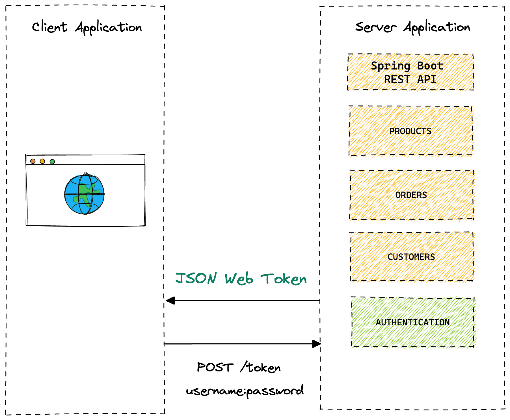
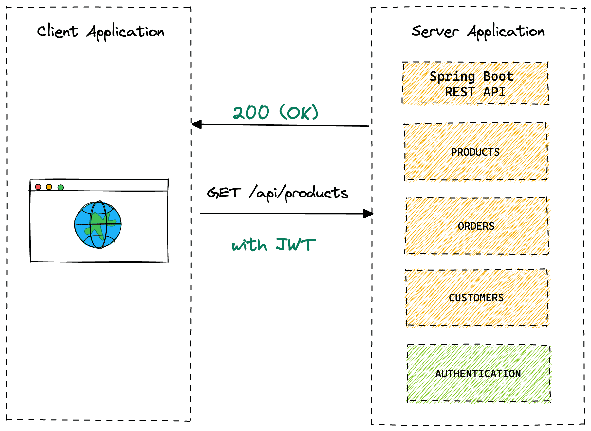
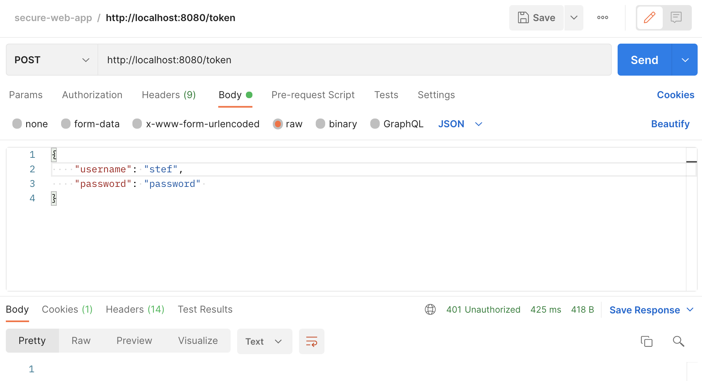
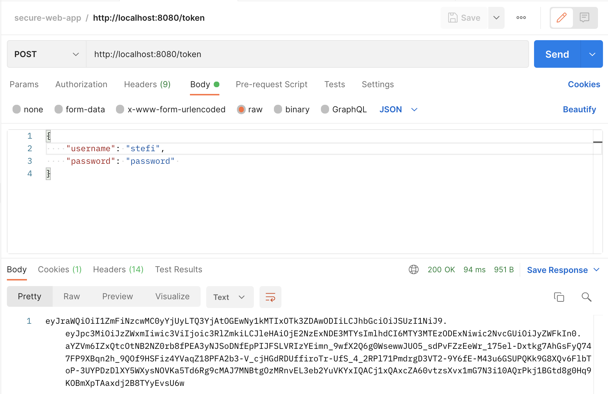
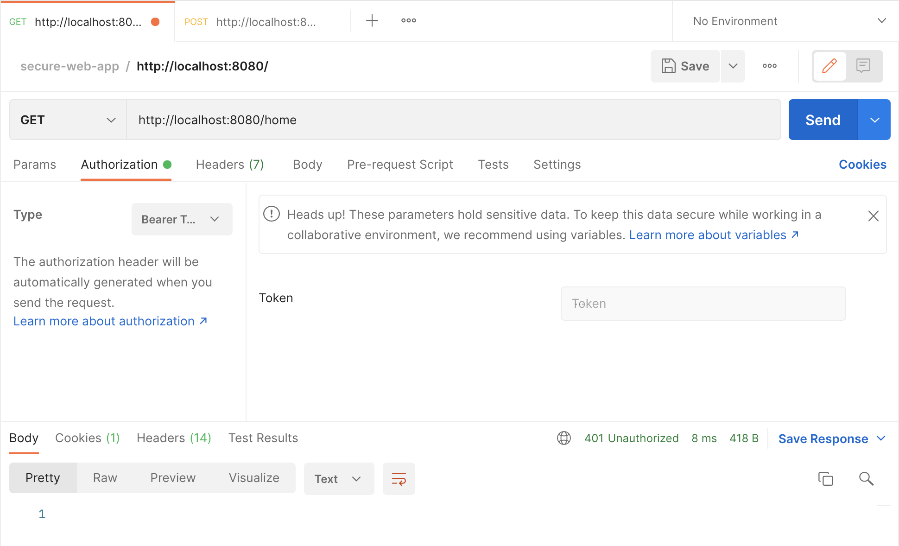
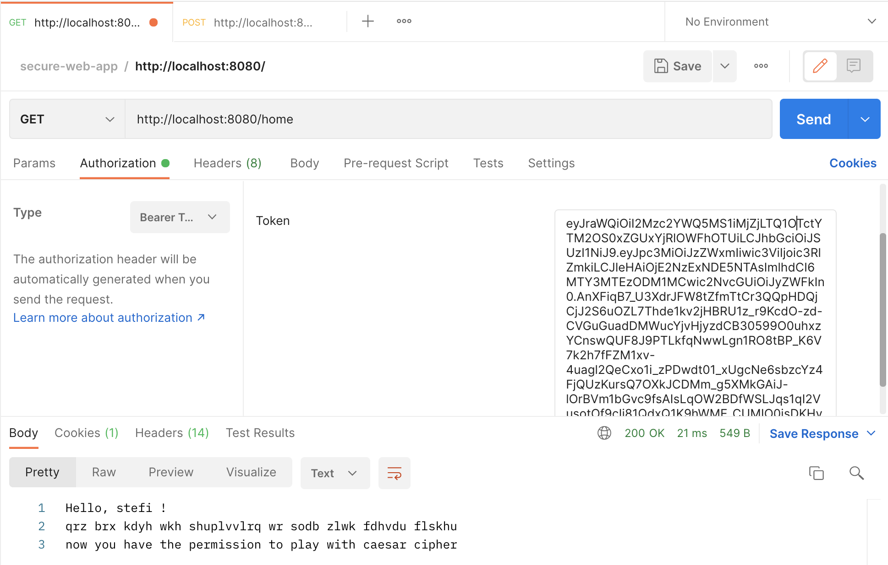

# Lab Nr. 5: Web Authentication & Authorisation.


---
## Table of Contents

* [Theory](#theory)
* [Objectives](#objectives)
* [Application Architecture](#application-architecture)
* [Implementation Description](#implementation-description)
* [Testing](#testing)
* [Conclusion](#conclusion)

## Theory

&ensp;&ensp;&ensp; Authentication & authorization are 2 of the main security goals of IT systems and should not be used interchangibly. Simply put, during authentication the system verifies the identity of a user or service, and during authorization the system checks the access rights, optionally based on a given user role.

&ensp;&ensp;&ensp; There are multiple types of authentication based on the implementation mechanism or the data provided by the user. Some usual ones would be the following:
- Based on credentials (Username/Password);
- Multi-Factor Authentication (2FA, MFA);
- Based on digital certificates;
- Based on biometrics;
- Based on tokens.

&ensp;&ensp;&ensp; Regarding authorization, the most popular mechanisms are the following:
- Role Based Access Control (RBAC): Base on the role of a user;
- Attribute Based Access Control (ABAC): Based on a characteristic/attribute of a user.


## Objectives:
1. Take what you have at the moment from previous laboratory works and put it in a web service / serveral web services.
2. Your services should have implemented basic authentication and MFA (the authentication factors of your choice).
3. Your web app needs to simulate user authorization and the way you authorise user is also a choice that needs to be done by you.
4. As services that your application could provide, you could use the classical ciphers. Basically the user would like to get access and use the classical ciphers, but they need to authenticate and be authorized.

## Application Architecture
This client application makes calls to a server application written in Spring Boot that exposes data via REST API.
All the resources are secured so that when the client makes a call to the REST API the client will get a 401 (Unauthorized) which means the client request has not been completed because it lacks valid authentication credentials for the requested resource.

I introduced a new authentication controller that a client can make a request to with their authentication credentials (username + password) and when they are successfully authenticated the service will return a JWT.



The client will then store the JWT and each subsequent request will pass it via the Authorization header. When the Server application receives the request with the JWT it will verify that it is a valid token and if it is will allow the request to continue.



## Implementation Description

#### REST API

The first thing I did is I created a REST API that I wanted to be secured.
To keep it simple I created ```HomeController``` in the ```controller``` package with a single method that returns a String.

```
@RestController
public class HomeController {

    @GetMapping
    public String home(Principal principal) {
        return "Hello, " + principal.getName();
    }

}
```
Later I will return an encrypted message to the authenticated user, using the Caesar Cipher implementation from ```CaesarService``` class in the ```service``` package.

#### SPRING SECURITY & OAUTH 2 RESOURCE SERVER CONFIGURATION 

For security configurations I created a new class in the ```config``` package called ```SecurityConfig```. The class has the following configuration:
```
@Bean
public SecurityFilterChain securityFilterChain(HttpSecurity http) throws Exception {
    return http
            .cors(Customizer.withDefaults())
            .csrf(AbstractHttpConfigurer::disable)
            .authorizeHttpRequests( auth -> auth
                    .requestMatchers("/token").permitAll()
                    .anyRequest().authenticated()
            )
            .sessionManagement(session -> session.sessionCreationPolicy(SessionCreationPolicy.STATELESS))
            .oauth2ResourceServer(OAuth2ResourceServerConfigurer::jwt)
            .build();
}
```
1. Disable Cross-Site Request Forgery (CSRF)
2. The user should be authenticated for any request in the application.
3. Spring Security will never create an HttpSession and it will never use it to obtain the Security Context.
4. Spring Security’s HTTP Basic Authentication support is enabled by default. However, as soon as any servlet-based configuration is provided, HTTP Basic must be explicitly provided.

The ```OAuth2ResourceServerConfigurer``` is an ```AbstractHttpConfigurer``` for OAuth 2.0 Resource Server Support. By default, this wires a ```BearerTokenAuthenticationFilter```, which can be used to parse the request for bearer tokens and make an authentication attempt.

Now that I have a custom security configuration in place I need a user that isn’t the default one provided by Spring Boot. The following configuration will create an in-memory user using the ```NoOpPasswordEncoder```. This is a password encoder that does nothing and is useful for testing but should **NOT** be used in production.
```
@Bean
public UserDetailsService userDetailsService() {
    return new InMemoryUserDetailsManager(
            User.withUsername("stefi")
                    .password("{noop}password")
                    .authorities("read")
                    .build()
    );
}
```
#### RSA PUBLIC & PRIVATE KEYS
Next, I need to encrypt the JWT by creating a public/private key pair using the following commands:
```
// create rsa key pair
openssl genrsa -out keypair.pem 2048

// extract public key
openssl rsa -in keypair.pem -pubout -out public.pem

// create private key in PKCS#8 format
openssl pkcs8 -topk8 -inform PEM -outform PEM -nocrypt -in keypair.pem -out private.pem
```

And now I can create a JwtDecoder using the public key.
One of the dependencies that the resource server brings in for us is ```spring-security-oauth2-jose``` which contains a library called ```Nimbus Jose JWT```. I can return a Nimbus JWT Decoder using the public key I just created.
```
@Bean
JwtDecoder jwtDecoder() throws JOSEException {
     return NimbusJwtDecoder.withPublicKey(rsaKey.toRSAPublicKey()).build();
}
```

#### AUTH CONTROLLER & TOKEN SERVICE
I have the keys in place, and I have defined a decoder which is a way to decipher the JWT. The user will need to log in with their username and password. If they pass authentication I generate a new JSON Web Token and send it back in the response.

To do this I created a bean of type ```JwtEncoder``` in the SecurityConfig. The encoder will be used to encode the signature into a token and sign it using the private key.

```
@Bean
JwtEncoder jwtEncoder() {
    JWK jwk = new RSAKey.Builder(rsaKeys.publicKey()).privateKey(rsaKeys.privateKey()).build();
    JWKSource<SecurityContext> jwks = new ImmutableJWKSet<>(new JWKSet(jwk));
    return new NimbusJwtEncoder(jwks);
}
```

Next, I created a new class called ```TokenService``` in a new package called ```service``` which will use the new JwtEncoder to generate a token. I configured the token to expire after 1 hour.


```
@Service
public class TokenService {

    private final JwtEncoder encoder;

    public TokenService(JwtEncoder encoder) {
        this.encoder = encoder;
    }

    public String generateToken(Authentication authentication) {
        Instant now = Instant.now();
        String scope = authentication.getAuthorities().stream()
                .map(GrantedAuthority::getAuthority)
                .collect(Collectors.joining(" "));
        JwtClaimsSet claims = JwtClaimsSet.builder()
                .issuer("self")
                .issuedAt(now)
                .expiresAt(now.plus(1, ChronoUnit.HOURS))
                .subject(authentication.getName())
                .claim("scope", scope)
                .build();
        return this.encoder.encode(JwtEncoderParameters.from(claims)).getTokenValue();
    }

}
```

Finally, I create a new controller in the ```controller``` package called ```AuthController```. This contains a single POST method that uses my new token service to generate a token for the authenticated user.

```
@RestController
public class AuthController {

    private static final Logger LOG = LoggerFactory.getLogger(AuthController.class);

    private final TokenService tokenService;
    private final AuthenticationManager authenticationManager;

    public AuthController(TokenService tokenService, AuthenticationManager authenticationManager) {
        this.tokenService = tokenService;
        this.authenticationManager = authenticationManager;
    }

    @PostMapping("/token")
    public String token(@RequestBody LoginRequest userLogin) throws AuthenticationException {
        Authentication authentication = authenticationManager
                .authenticate(new UsernamePasswordAuthenticationToken(userLogin.username(), userLogin.password()));
        return tokenService.generateToken(authentication);
    }

}
```

## Testing
#### Postman

The first thing we need to verify is the *authentication* process. We do that by entering one of our user's credentials into the body of the POST request sent to the /token endpoint.

For testing purposes I entered an incorrect username, and as a result I got a *401 Unauthorized* error.




If everything works and the credentials are entered correctly we get back the generated JWT in the response.



Next step is to verify the *authorization* process:
1. Copy the JWT from previous step
2. Create a new GET request for http://localhost:8080/home
3. Go to the Authorization tab and select Bearer Token
4. Paste in the generated token

Again, for testing purposes I didn't paste anything into the Bearer Token and we get an *401 Unauthorized* error.



If the token is passed in we get a message and the permission to play with Caesar Cipher :)



## Conclusion

In conclusion, in this laboratory work I learned some interesting and useful concepts like Authentication and Authorization.
As a result, I got a fully secured app with complete registration, authentication and authorization processes.
